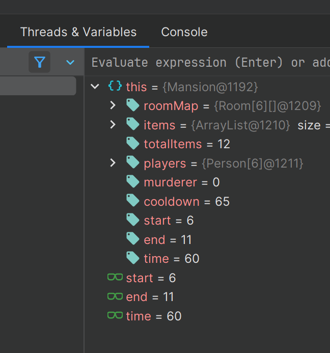

# solo quest: to hunt a killer
**`Quest giver: an old storyteller`**
>Welcome dear debugging detectives, to a night steeped in mystery. The Mansion awaits, ready for its guests, filled with eerie rooms and items. As the sun sets, the guests enter, and the storm rages on. But unknowingly, not all will leave...

## Special Note
In this quest, you will investigate a virtual murder mystery by debugging its code.  The code simulates a generic board game, in which characters move through a mansion and interact with items while being pursued by a rogue murderer amongst them.

- **You will only push the auto-generated `Answers.out` file that gets created after you run the program.**
- **You do not need to write a single line of code to complete the quest**
- **To generate `Answers.out`, simply run the `MurderMystery.java` runner class and answer the questions that are asked after the game runs**

## Overview
>It's a dark and stormy night.  The wind howls through the trees as lightning flashes across the sky.  Through the fog and out of the shadows, it appears...the Mansion.

You are investigating a murder mystery, by debugging certain aspects of the simulation found within the Mansion class.

- The Mansion class holds a grid of unique rooms, a cast of 6 characters (including the murderer), and an assortment of items
- The rooms, players, items, player decisions, questions, and more are all randomly determined by the loginID entered in the MurderMystery runner file when prompted.  This means that each mystery is unique, and must be solved differently

**When running the `MurderMystery.java`, you will be asked a series of random questions about the nights events.  Use the built in IntelliJ Debugger with clever breakpoints inserted to be able to answer the questions when prompted.  Push your `Answers.out` file back to GitHub to see how you scored.**

**Note:** Do not modify code related to the game behavior.  If you happen to write print statements, or even comments it will shift line numbers and cause your answers to not match correctly.

### Helper Class Descriptions
`Mansion.java`
- this is the "game board" where the Murder Mystery events unfold.
- important attributes of this class:
  - Room[][] roomMap - 2D array of `Room` objects that make up the mansion
  - Person[] players - array of the 6 characters for your specific version of the game
  - int time - the current time, always a multiple of 5
    - equals minutes past 6:00pm (the start of the party)
    - example: time = 175; means it is 175 minutes past 6, or 8:55pm
- the method `nextTurn()` runs a single turn of the game
  - a single turn is 5 in-game minutes
  - specific information about how this method run can be read in the comments
  - in a turn, players will each have a chance to move AND pick up/drop items
    - the murderer will move last each turn, and you know attempt to murder the other players
  - the method will return false if the game has ended, and true otherwise

**you will not need to debug any of the below helper classes to solve the questions, they are all solved from debugging `Mansion.java`**

`MurderMystery.java`
- the runner class use to start the game and print the story
- when you run this it will ask for your loginID.  enter your loginID to start.
  - a story will start to print on the screen.  after, it will print a short ending.
  - you will then be asked 12 questions, which you can answer right in the console.  this will generate `Answers.out` that you must push back to GitHub.

`Person.java`
- represents a character in the game
- each character has attributes relating to their name, if the player is alive, current position/dice roll, and more
- the `Person` class has methods that implement movement decisions for players, which is different for an innocent person vs the murderer

`Item.java`
- represents an item found within the mansion
- every possible room has an associated item
- after the mansion is created a set number of items will be randomly chosen and placed in their rooms
  - the murderer has brought a revolver to the party and therefore it is not an item that spawns from the game
- each item has attributes relating to its name, if it's a murder weapon or not marked, what room it belongs to, and more
- if an item is used in a murder, it will be marked **true**, players can no longer pick up murder weapons

`Room.java`
- represents a room within the mansion
- all players start in the same room, `The Foyer`
- each room (except `The Foyer`) has a corresponding item that may or may not spawn inside it

`Multiple .in files`
- represent intro/ending text, player names, item names, room locations, and more
- do not modify these files

`Answers.out`
- generated after running `MurderMystery.java` and answering the questions
- only thie file should be pushed back to GitHub

### Objective 0 - The First Run
**Tasks to complete this objective**
[] 1. Run `MurderMystery.java`
[] 2. Write down your specific questions
[] 3. Push your generated `Answers.out` file back to GitHub
[] 4. View results on GitHub

#### Run `MurderMystery.java`
- run this file
- enter your loginID
- print the intro out
- read the story

#### Write down your specific questions
- make note of when the game ends
- how many survivors are left
- was the murderer caught
- write down your specific questions being asked
  - knowing specific names in the questions or times can help with where to put the debug statements
- answer with a `?` for each question on this first run through

#### Push `Answers.out` back to GitHub

#### View Results on GitHub

### Objective 1 - Locate the needed lines and breakpoint them
**Tasks to complete this objective**
[] 1. Locate important lines of code
[] 2. Add breakpoints, and conditions to them if needed

#### Locate important lines of code
- `Mansion.java` is where all the code to answer the questions happens
- `nextTurn()` method in this class will help with 90% of the questions
- look for lines related to:
  - picking up items 
  - dropping items
  - player movement
  - other game actions

#### Add breakpoints with or without conditions on them
- set a breakpoint at the start of the method to check:
  - room count
  - item count
  - murderer name, and more
- set a breakpoint on the two `return false` statements in `nextTurn()` to stop at the end of the game
- other helpful breakpoint ideas
  - set a breakpoint at the `.kill()` method call, with a condition to check if it's killing a certain player
  - set a breakpoint everywhere `player.pickUp(item)` happens, with a condition for `item.getName()` to equal a certain item name
  - set a breakpoint at the end of the method, to find out where player are/moved
  - you may have different breakpoints needed depending on your specific questions

##### Debugging Guide
- to add a breakpoint simply click on the line number

- to add a condition to a breakpoint, right-click on the red circle
  - conditions should be boolean expressions
  - if the breakpoint is a normal line it should end with a `;`
  - if the breakpoint is on an if statement or loop it does not need to end with a `;`

### Objective 2 - Rerun MurderMystery.java in debug mode and get answers
**If your breakpoint are in correct places you can answer all of your questions on this second run through without the need for additional run throughs**

**Tasks to complete this objective**
[] 1. Run `MurderMystery.java` in debug mode
[] 2. Write down the answers as you move through the program

#### Run `MurderMystery.java` in debug mode
- while in the `MurderMystery.java` file right-click and select the `Debug` option

- you may also click the `red bug` at the top of the while as long as `MurderMystery.java` is the current file being run

#### Write down the answers as you move through the program
- your program will start running in the console

- you can skip the story intro this time and your program will automatically go to the first breakpoint and stop

- when you are on a breakpoint you can view information about the simulation at the current line of code
- once you have the information you need you can move to the next breakpoint to stop again
  - clicking on the icon that says resume program

- after you got information needed from a breakpoint, you may not want the program stopping at that point anymore
  - in this case you can disable the breakpoint so it will be skipped over going forward
  - right-click on the breakpoint to bring up the options for it, it is the same window for adding a condition
  - uncheck the `enabled` option

